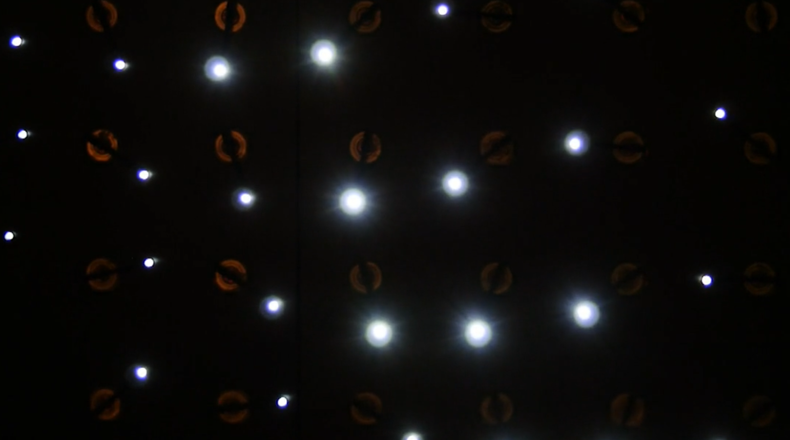

# NoraZheng_nzhe0074_IDEA9103_tut4

# How to interact with the work
  Please open the page and wait. The animation would show automatically.

# Details of invidual work

### 1.Personal code
I choose to use Perlin noise and randomness to drive my individual code generating and moving circles by using `noise()`function as well as creating a beautiful dynamic effect.
### 2.Individual approach to animating the group code.
The circles will be moved from left of the canvas to the right  in a wave-like pattern.
### 3.Inspiration
I was inspired a lot by this video from vimeo. In this video, every circle was moved randomly in different ways which generated a beautiful effect.

 teamVOID. (2024b, May 29). Light wave [Video]. Vimeo. https://vimeo.com/105414331

### 4.Technical explanation
#### Add New Variables

- __speed__: Controls the speed of movement for the circles.
- __bgCircles__: Array to store background circles.
- __time__: Controls the variation in the wave pattern.

#### Updating in Setup Function:
- __`frameRate(60)`__: Sets the frame rate to 60 frames per second for smoother animation.

#### Updating in Draw Function:
- __Circle Movement__: Existing circles move to the right based on the speed variable.
- __Wave Effect__:The time variable is incremented to create a changing wave pattern effect.

#### Changes in Circle Class:
- __Position and Drawing__:Circles' positions are updated and patterns are drawn to reflect changes in time and position.
- __Vertical Position__: Uses the `noise() `function to determine vertical positions, creating a wave-like effect.
- __Handling Overlap__ Removes the code for preventing circle overlap.

Together, these updates build a dynamic background where the motion circles are controlled by speed and time with `noise()` function in a wave-like patten.

